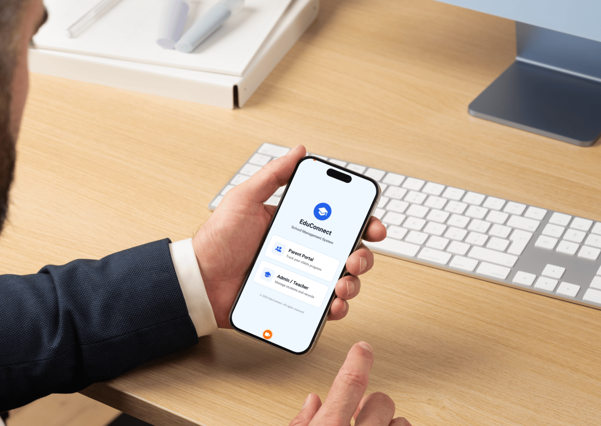
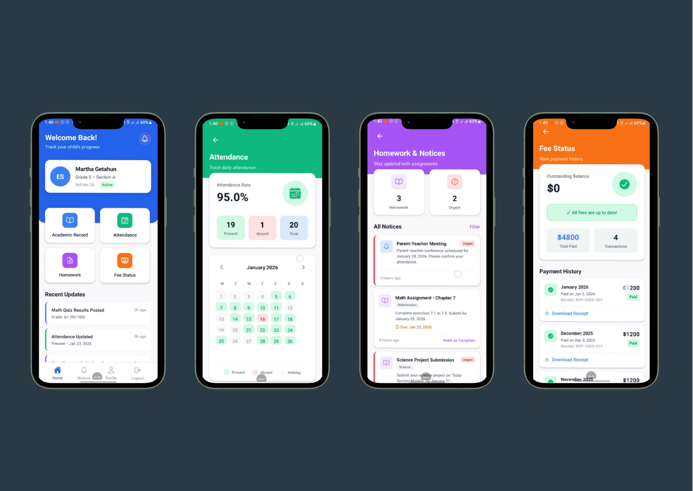
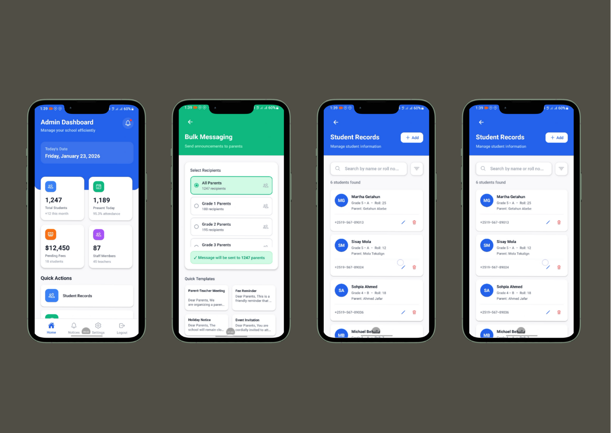

# EduConnect — School Management System

A cross-platform **Flutter** application for managing a school, built around two distinct experiences: a **Parent Portal** for tracking a child's progress and an **Admin / Teacher** console for managing students and school operations.

Runs on Android, iOS, Web, and Windows from a single codebase.

<p align="center">
  
</p>

---

## ✨ Features

### 👨‍👩‍👧 Parent Portal
- **Login** — dedicated parent sign-in flow
- **Dashboard** — welcome overview with quick actions
- **Academic Record** — view grades and academic performance
- **Attendance** — track daily attendance
- **Homework & Announcements** — assignments and school notices
- **Fee Status** — outstanding balances and payment history

### 🏫 Admin / Teacher Console
- **Login** — dedicated admin sign-in flow
- **Dashboard** — key stats (total students, present today, pending fees, staff) and recent activity
- **Student Records** — manage student information
- **Bulk Messaging** — send messages to parents/students at scale
- **Report Generator** — generate academic and administrative reports

### 🎨 Shared UI
- Role selector landing screen
- Consistent theming via a Material 3 color scheme (seed `#2563EB`)
- Reusable UI kit: gradient scaffold, primary buttons, cards, inputs, and a shared color palette

---

## 📸 Screenshots

### Parent Portal
Dashboard, attendance tracking, homework & notices, and fee status.



### Admin / Teacher Console
Dashboard with key stats, bulk messaging, and student records.



---

## 🛠️ Tech Stack

| Area          | Details                                    |
| ------------- | ------------------------------------------ |
| Framework     | Flutter (Dart SDK `^3.9.0`)                |
| UI            | Material 3                                 |
| Navigation    | Named routes (`lib/app_routes.dart`)       |
| Icons         | `cupertino_icons`                          |
| Linting       | `flutter_lints`                            |
| Platforms     | Android · iOS · Web · Windows              |

---

## 📁 Project Structure

```
lib/
├── main.dart                  # App entry point, theme & route table
├── app_routes.dart            # Centralized route names
├── screens/                   # Feature screens
│   ├── role_selector_screen.dart
│   ├── parent_login_screen.dart
│   ├── parent_dashboard_screen.dart
│   ├── academic_record_screen.dart
│   ├── attendance_screen.dart
│   ├── homework_announcements_screen.dart
│   ├── fee_status_screen.dart
│   ├── admin_login_screen.dart
│   ├── admin_dashboard_screen.dart
│   ├── student_records_screen.dart
│   ├── bulk_messaging_screen.dart
│   ├── report_generator_screen.dart
│   └── placeholder_screen.dart
└── widgets/                   # Reusable UI components
    ├── app_colors.dart
    ├── gradient_scaffold.dart
    ├── primary_button.dart
    └── ui/                     # UI kit (button, card, input)
```

---

## 🚀 Getting Started

### Prerequisites
- [Flutter SDK](https://docs.flutter.dev/get-started/install) (Dart `^3.9.0`)
- A device or emulator (Android/iOS), or a browser/desktop target

### Installation

```bash
# 1. Clone the repository
git clone https://github.com/Miki-b/Edu-Connect.git
cd Edu-Connect

# 2. Fetch dependencies
flutter pub get

# 3. Run the app
flutter run
```

### Run on a specific platform

```bash
flutter run -d chrome     # Web
flutter run -d windows    # Windows desktop
flutter run -d android    # Android device/emulator
```

---

## 🧪 Development

```bash
flutter analyze     # Static analysis / lints
flutter test        # Run unit & widget tests
flutter build apk   # Build a release APK
flutter build web   # Build for the web
```

---

## 📌 Notes

This project currently focuses on the **UI/UX layer** with sample data. It provides a solid foundation for wiring up a backend (authentication, database, and APIs) to power live school data.

---

## 📄 License

This project is provided as-is for educational and demonstration purposes.

© 2026 EduConnect. All rights reserved.
